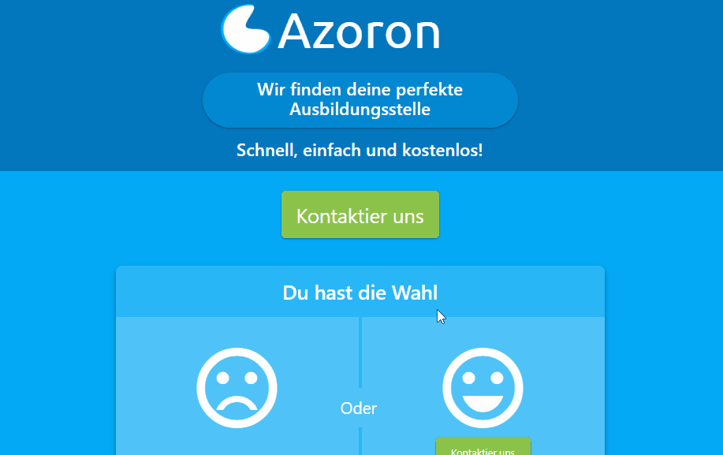

# Azoron Webdesign | Custom CSS Design

This project is programmed without any frameworks designed with custom css. Basicaly it is a landing page with one dynamic element. Designed and executed in 2017 by me.

## More about the project

Azoron was a tiny project, basicaly only a landing page, completly custom CSS designed to be resoinsive to mobile phone. The premise of this company is explained in german on the website.

# [Try it 🕹️](https://htmlpreview.github.io/?https://github.com/DennisRauscher/Azoron/blob/master/public/index.html)

If the demo is offline you can also download the files and go to **/public/index.html** and open it in your browser of choice.

## What was used?

HTML, CSS (SCSS) and a small Node backend to serve it.

### Prerequisites

Required:
- None

Optional:
- Editor ([VSCode](https://code.visualstudio.com/) is recommended)

### Getting Started

To install this project on your own maschine for further development you can simply clone this repository and run the **tsc-watch.bat** and the **comp-sass.bat**.

The **index.html** can now be opened in the browser and refreshed as you changed anything.

## Get Involved

I would love to see modifications or additions to this project, in case you have any questions just contact me [here](https://dennisrauscher.de/).

## Authors

* **Dennis Rauscher** - *Initial work* - [GitHub](https://github.com/DennisRauscher)

## License

This project is licensed under the MIT License - see the [LICENSE.md](LICENSE.md) file for details
